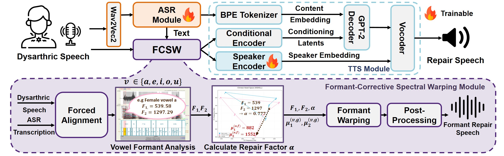

# Formant-Guided Speech Repair for Enhanced Comprehension of Mandarin Dysarthric Speech

This repository hosts the official code for **Formant-Guided Speech Repair for Enhanced Comprehension of Mandarin Dysarthric Speech**.
The framework aims to improve listener comprehension of dysarthric Mandarin speech by leveraging both **acoustic formant correction** and **text-guided speech reconstruction**.

---

## 🖼 Framework Overview

Below is an illustration of the proposed system:

*Figure: Overview of the Formant-Guided Speech Repair system.*

---
## 🌐 Demo

You can explore our demo page here:
👉 [Speech Repair Demo](https://xinyu0308.github.io/Speech_Repair/)

---
## 📂 Modules

This framework integrates three core modules:

### 📝 ASR Module

* **Goal:** Transcribe Mandarin dysarthric speech using pretrained self-supervised models.
* **Key Features:**

  * Integrates **ESPnet**, **Fairseq**, and **S3PRL**.
  * Uses pretrained **chinese-wav2vec2-large** for robust ASR.
* **Details:** See [Pretrained Model-based ASR README](./ESPnet/CDSD/README.md).

---

### 🎶 Formant-Corrective Spectral Warping (FCSW)

* **Goal:** Repair vowel distortions by correcting formant frequencies.
* **Key Features:**

  * Uses **Montreal Forced Aligner (MFA)** for phone-level alignment.
  * Extracts vowel statistics and applies spectral warping for correction.
* **Details:** See [FCSW README](./FCSW/README.md).

---

### 🔊 TTS with Speaker Adaptation

* **Goal:** Generate natural Mandarin speech from text, conditioned on dysarthric speakers.
* **Key Features:**

  * Finetune XTTS speaker encoder with your own dataset.
  * Generate speech using reference audio to preserve speaker identity.
* **Details:** See [TTS with Speaker Adaptation README](./XTTS/README.md).

---

## 🔗 Workflow Integration

These modules can be combined into a **speech repair pipeline**:

1. **ASR Module** transcribes dysarthric speech into text.
2. **FCSW Module** normalizes distorted vowels for cleaner acoustic cues.
3. **TTS with Speaker Adaptation** regenerates repaired speech while preserving speaker identity.

---

## 📚 References

* [TencentGameMate](https://github.com/TencentGameMate)
* [ESPnet](https://github.com/espnet/espnet)
* [Fairseq](https://github.com/facebookresearch/fairseq)
* [S3PRL](https://github.com/s3prl/s3prl)
* [Montreal Forced Aligner](https://montreal-forced-aligner.readthedocs.io/en/latest/getting_started.html)
* [Coqui TTS](https://github.com/coqui-ai/TTS)

---

